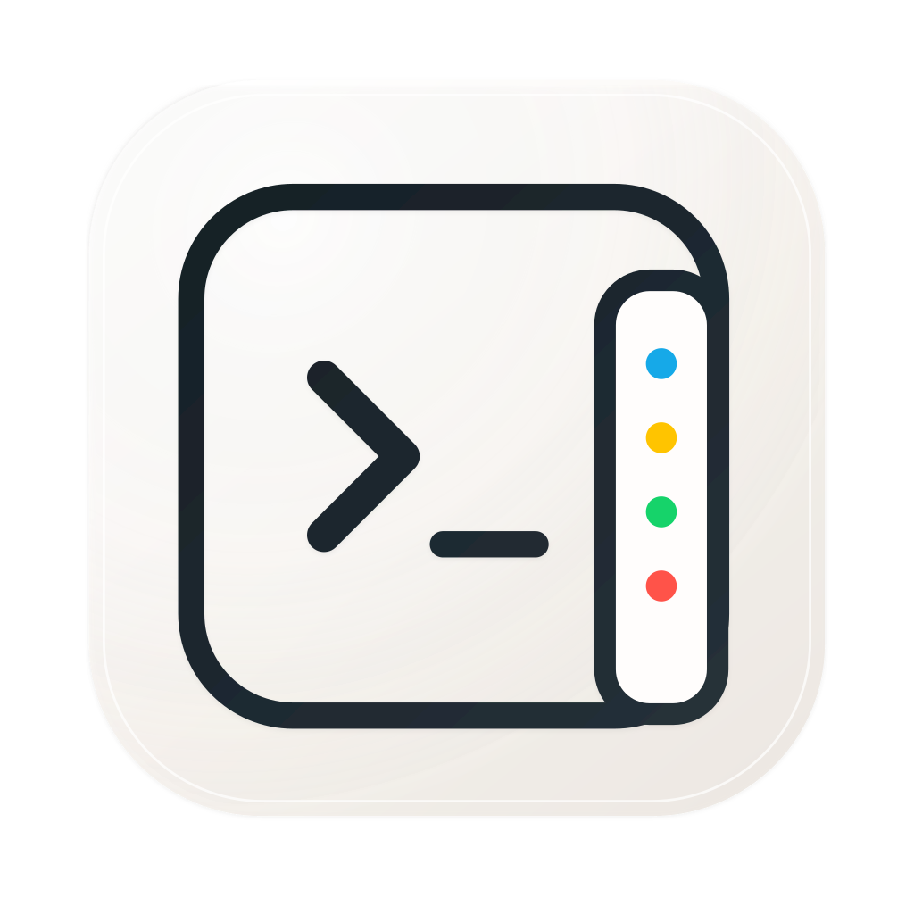
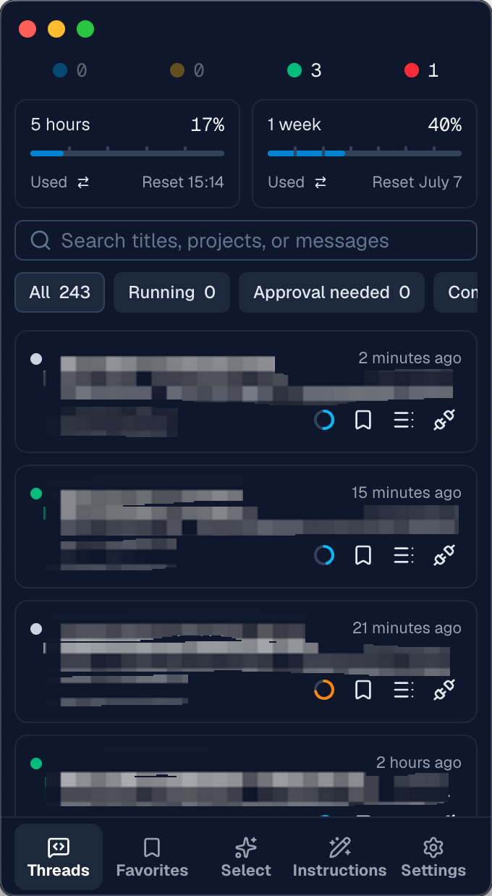
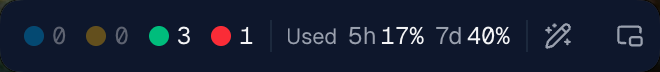

<div align="center">
  

  <h1>Codex Sidecar</h1>

  <p>
    A Codex companion tool for managing Codex conversations, favorites, usage limits, context usage, conversation continuation, selection runs, reusable instructions, and more.
  </p>

  <p>
    <a href="https://github.com/eshengsky/Codex-Sidecar/blob/main/LICENSE"></a>
    <a href="https://github.com/eshengsky/Codex-Sidecar/releases/latest"></a>
    
    
    
  </p>

  <p>
    <a href="./README.md">English</a> ·
    <a href="./README.zh-CN.md">简体中文</a>
  </p>

  <p>
    <a href="https://github.com/eshengsky/Codex-Sidecar/releases/latest/download/Codex-Sidecar-mac-arm64.dmg">Download for Apple Silicon</a> ·
    <a href="https://github.com/eshengsky/Codex-Sidecar/releases/latest/download/Codex-Sidecar-mac-x64.dmg">Download for Intel</a>
  </p>
</div>

<br/>

<table align="center">
  <tr>
    <td align="center">
      <br/>
      <sub>Main window</sub>
    </td>
    <td align="center">
      <br/>
      <sub>Mini bar</sub>
    </td>
  </tr>
</table>

## What Is Codex Sidecar?

Codex Sidecar is a macOS companion tool for Codex Desktop. It does not replace the Codex chat window; it adds the organization, monitoring, and continuation capabilities that heavy Codex use often needs.

## Why Sidecar?

Codex Desktop is already powerful, but long-running use still exposes a few concrete gaps:

- There is no global status overview for quickly scanning which tasks are running, waiting for approval, completed but unread, or failed.
- You may want to save an important conversation, but pinning it in Codex is too heavy.
- You may want to save a specific Q&A turn, but Codex does not provide a lightweight entry point.
- You cannot always see usage limits and reset times at a glance.
- You cannot quickly tell which long conversations are close to filling their context window.
- When a long task needs to continue in a new conversation, manually preparing the handoff context takes time.

Sidecar is designed to solve these practical gaps and add a few useful workflows, making Codex better suited for long, heavy sessions.

## Features

### Conversation Overview

Manage Codex tasks globally through four status indicators: running, waiting for approval, completed unread, and failed. Click a number to view the conversations in that status, so you do not need to hunt through Codex windows when multiple tasks are active.

### Conversation Favorites

Save conversations to Sidecar without turning them into pinned Codex conversations. Favorites are local Sidecar data, useful for conversations you will need again but do not want permanently pushed to the top.

### Message Favorites And Navigation

Sidecar can save a Q&A turn and search favorites by message content, project, or conversation title. Clicking a favorite opens the corresponding Codex conversation.

### Usage Monitoring

Sidecar shows Codex usage windows in the mini tool and main panel, including used / remaining usage and reset times.

### Context Usage

Each conversation can show its current context usage. Low usage stays quiet; higher usage suggests conversation continuation; risk-level usage prompts you to continue before a long conversation loses important context.

### Conversation Continuation

When a long conversation needs to move into a new conversation, Sidecar can generate copyable continuation text that preserves the current goal, user constraints, completed work, key decisions, verification status, and next steps. The original conversation is not modified.

### Selection

Selection runs 2-5 read-only Codex conversations in parallel, lets them answer the same task independently, then compares and summarizes the results into a steadier answer. It trades more tokens and time for quality, and is useful for architecture decisions, complex plans, copy polishing, image-input analysis, and other tasks that benefit from multiple candidates.

### Instruction Library

Save lightweight, temporary, frequently used instruction text with search, editing, and copy support. Long-term project rules should still live in `AGENTS.md`, and repeatable workflows are better modeled as Skills; the Sidecar instruction library is for temporary commands and prompts that may need another edit.

### Mini Tool

Sidecar provides a lighter mini window for keeping status, usage, and shortcuts visible. It is useful as a narrow, quiet status surface beside the main Codex window.

### Local-First

Sidecar-owned data is stored locally, including favorites, instructions, selection runs, window state, context-usage cache, and settings. It works around the local Codex Desktop app and does not provide an extra cloud sync service.

## Download

- Latest release: [github.com/eshengsky/Codex-Sidecar/releases/latest](https://github.com/eshengsky/Codex-Sidecar/releases/latest)
- All releases: [github.com/eshengsky/Codex-Sidecar/releases](https://github.com/eshengsky/Codex-Sidecar/releases)

| Platform | Architecture | Installer |
| --- | --- | --- |
| macOS | Apple Silicon | [Codex-Sidecar-mac-arm64.dmg](https://github.com/eshengsky/Codex-Sidecar/releases/latest/download/Codex-Sidecar-mac-arm64.dmg) |
| macOS | Intel | [Codex-Sidecar-mac-x64.dmg](https://github.com/eshengsky/Codex-Sidecar/releases/latest/download/Codex-Sidecar-mac-x64.dmg) |

## First Run

1. Make sure Codex Desktop is installed and running.
2. Download and install Codex Sidecar.
3. Launch Sidecar, then trust and enable the related Hooks in Codex settings when prompted.
4. Return to Sidecar and start using it.

## Developer Guide

### Tech Stack

- **Desktop**: Electron
- **Frontend**: Vite, Vue 3, TypeScript, Vue I18n
- **Components and styling**: @nuxt/ui, Tailwind CSS, Iconify / Lucide
- **Local data**: better-sqlite3, local JSON runtime state
- **Packaging and release**: electron-builder, GitHub Actions

### Requirements

- **Node.js** 24
- **pnpm** 11.3.0
- macOS
- Codex Desktop installed

### Local Development

```bash
pnpm i
pnpm dev
```

### Release Build

Create a local macOS DMG for the current architecture:

```bash
pnpm release:local
```

## License

MIT
